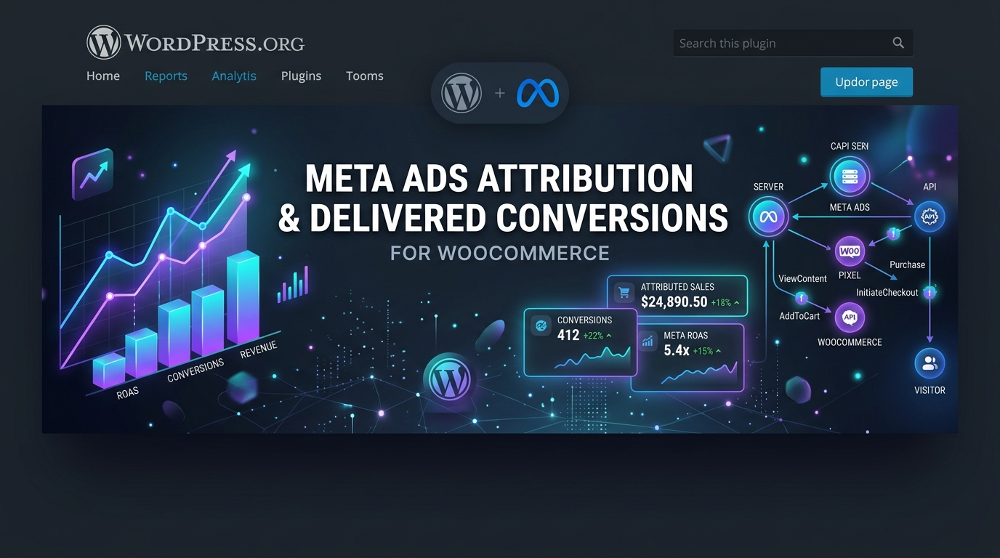
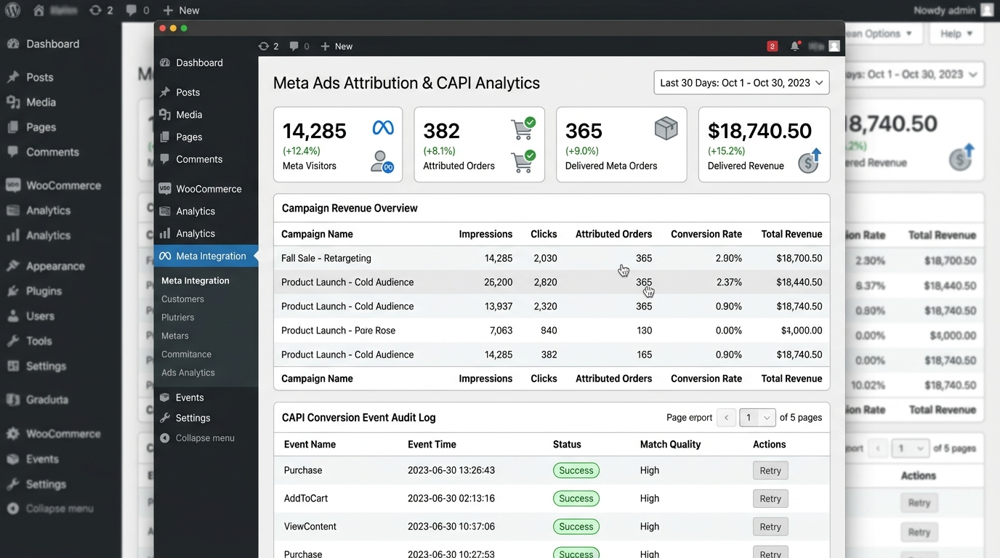
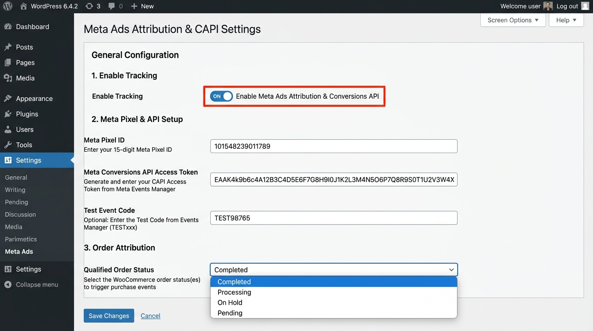

# Meta Ads Attribution & Delivered Conversions for WooCommerce

  

  
  
  <a href="https://woocommerce.com">%3D5.0-purple.svg" alt="WooCommerce"></a>
  <a href="https://wordpress.org">%3D5.8-blue.svg" alt="WordPress"></a>

Production-ready Meta/Facebook Ads attribution, customer journey tracking, order attribution, and qualified **DELIVERED** order Conversions API (CAPI) plugin for WooCommerce by **RsmMonaem** (`vrkm55@gmail.com`).

---

## 🌟 Overview & Real-World Use Case

### The E-Commerce Attribution Problem
Traditional Facebook/Meta Ads tracking relies heavily on browser-side Pixel events fired immediately upon checkout. In real-world WooCommerce businesses (especially Cash on Delivery, COD, or fulfillment-heavy e-commerce):
1. **Unqualified Conversions**: 20-40% of orders placed online get cancelled, returned, or fail delivery before customer payment. Reporting unverified orders to Meta Ads distorts your Return on Ad Spend (ROAS) and tricks Meta algorithms into optimizing for fake buyers.
2. **iOS 14.5+ Signal Loss**: Safari ITP and ad-blockers wipe out browser pixel tracking, losing attribution for over 30% of paid ad clicks.

### The Solution: Meta Ads Attribution for WooCommerce
This plugin solves both problems by providing:
1. **First-Party Touchpoint Attribution**: Intercepts `fbclid` and UTM parameters on the first click, sets a 90-day first-party cookie (`meta_visitor_id`), formats `_fbc` and `_fbp` cookies, and logs the customer's journey touchpoints.
2. **Qualified DELIVERED Conversion Trigger**: Fires Meta Conversions API (CAPI) `Purchase` events **ONLY** when WooCommerce order status transitions to **COMPLETED / DELIVERED**.
3. **SHA-256 Customer PII Hashing & Event Deduplication**: Hashes customer PII per Meta specs and matches browser Pixel events using deterministic `event_id` keys (`purchase_{order_id}`).

---

## 📸 Visual Previews & Dashboard Screenshots

### 📊 Admin Analytics Dashboard
Monitor Meta visitors, sessions, attributed orders, delivered revenue, conversion rate, campaign ROAS breakdown, and live CAPI audit logs.

---

### ⚙️ Plugin Configuration & Settings
Configure your Meta Pixel ID, Conversions API Access Token, Test Event Code, and Qualified Order Status trigger.

---

## 🚀 Key Features

* **First-Party Visitor Tracking**: Captures `fbclid`, `utm_source`, `utm_medium`, `utm_campaign`, `utm_term`, `utm_content`, landing page, referrer, IP, and user-agent.
* **90-Day Visitor Tracking Cookie**: Preserves customer acquisition touchpoints across multi-page browsing, cart additions, login, registration, and guest checkout.
* **Qualified Delivered Conversion Trigger**: Sends the server-side `Purchase` event to Meta **ONLY** when WooCommerce order status changes to COMPLETED / DELIVERED.
* **Event Deduplication**: Frontend browser Pixel and backend CAPI events share deterministic `event_id` parameters (e.g. `purchase_10025`) to prevent double counting.
* **SHA-256 Customer PII Hashing**: Normalizes and hashes customer email, phone, name, city, state, postal code, country, and external ID per Meta specs.
* **Admin Dashboard & Audit Log**: Live metrics cards, campaign revenue breakdown, CAPI audit log with status badges, and 1-click event retries.

---

## 🗄️ Database Architecture

The plugin automatically creates 4 custom database tables on activation:

| Table Name | Description |
| :--- | :--- |
| `{$wpdb->prefix}meta_ad_attributions` | Stores visitor first-party cookies, `fbclid`, `_fbc`, `_fbp`, and first/last touch timestamps. |
| `{$wpdb->prefix}meta_tracking_sessions` | Audit trail of session pageview URL requests and referrer URLs. |
| `{$wpdb->prefix}meta_order_attributions` | Maps WooCommerce order IDs to original Meta acquisition campaign parameters. |
| `{$wpdb->prefix}meta_conversion_events` | CAPI event dispatches audit log with HTTP status, retry counts, and error trace. |

---

## 🛠️ Step-by-Step Installation Guide

### Option A: Upload ZIP via WordPress Admin (Recommended)
1. Download `meta-ads-attribution-for-woocommerce.zip` from [Releases](https://github.com/rsmmonaem/meta-ads-attribution-for-woocommerce/releases).
2. Go to **WordPress Admin -> Plugins -> Add New -> Upload Plugin**.
3. Select `meta-ads-attribution-for-woocommerce.zip` and click **Install Now**.
4. Click **Activate Plugin**.

### Option B: Manual Installation via FTP / SSH
1. Unzip the plugin folder `meta-ads-attribution-for-woocommerce`.
2. Upload the folder to `/wp-content/plugins/meta-ads-attribution-for-woocommerce/`.
3. Go to **WP Admin -> Plugins** and click **Activate**.

---

## ⚙️ Configuration Setup

1. Go to **WP Admin -> Meta Attribution -> Settings**.
2. Enter your **Meta Pixel ID** (e.g. `123456789012345`).
3. Enter your **Meta Conversions API Access Token** (generated in Meta Events Manager settings).
4. Set **Qualified Order Status** (e.g. `Completed`).
5. Save Settings.

---

## 📄 License & Credits

Developed & Maintained by **RsmMonaem** (`vrkm55@gmail.com`).  
Licensed under the [GNU General Public License v2.0 or later](LICENSE).
